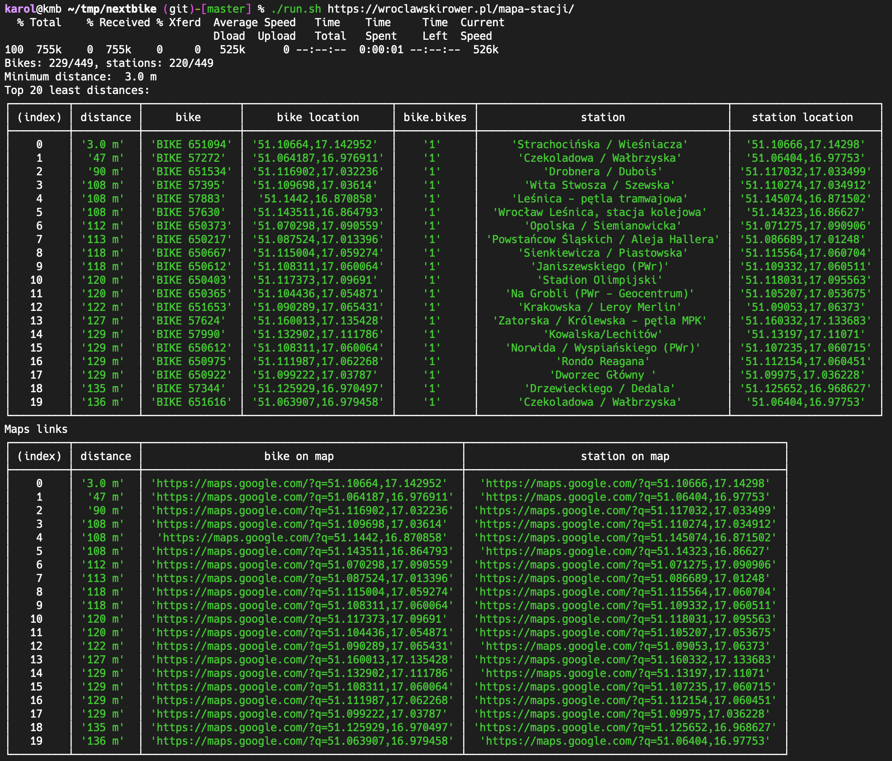

# A script that finds out how close Nextbike's bikes can be left from their stations

How you ever wondered how far away can you leave a Nextbike loaner bike from one of its stations, but have it still count as left on the station to avoid paying the fee?

Well, now you can find out.



## Usage

```bash
$ git clone https://github.com/karolba/nextbike-bike-station-distance
$ cd nextbike-bike-station-distance
$ npm install
$ ./run.sh 'https://wroclawskirower.pl/mapa-stacji/' # A link to a Nextbike map for your city
```

## Results

For Wrocław, it seems that the maximum distance is about 100 meters - bikes to stations closer than that appear from time to time (as can be seen on the screenshot) but there's always only a few of them - I assume those are some sort of flukes.
